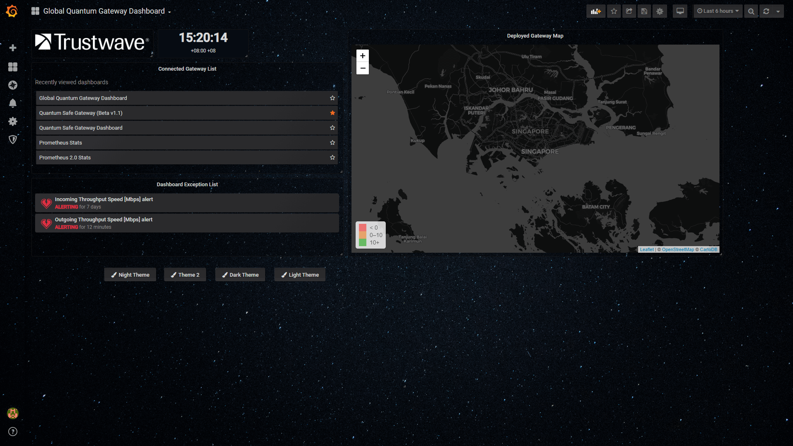
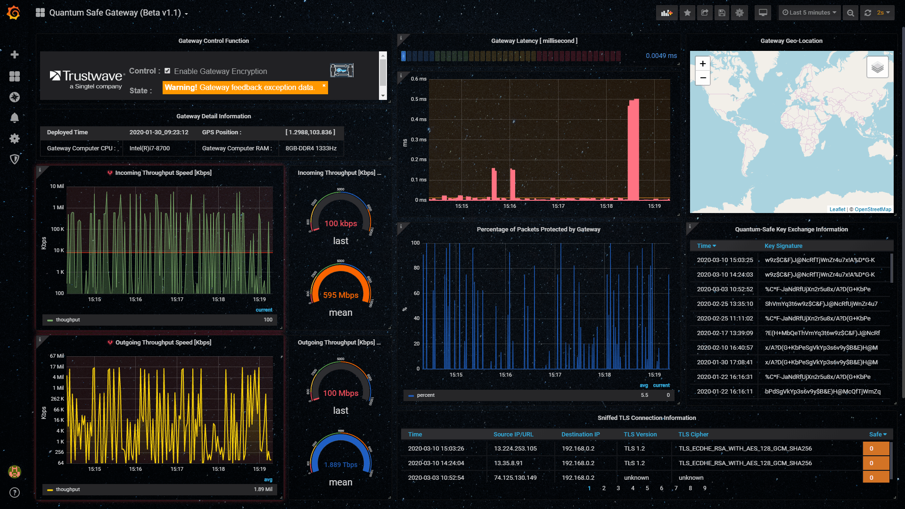
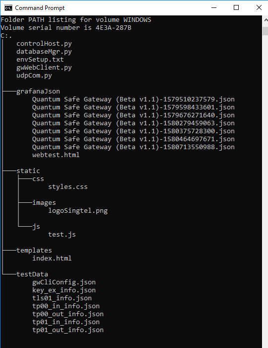

# QSG-Manager
### Introduction

Dashboard GUI to monitor internal status of our quantum safe gateways.

- Show a global gateway set dashboard to show all quantum safe gateways status. 

- Display gateway basic configuration information: gateway ID, IP address, quantum encryption info, deployed time, geo-location and gateway hardware info. 
- Display gateway running time information: incoming&outgoing throughput, % of packets protected, sniffed TLS connection info, key exchange and gateway overhead latency. 
- Show gateway control function: encryption enable/disable, refresh encryption key.


###### Global Gateway Set Dashboard Page UI



###### Individual Gateway Dashboard Page UI 



------

### Program Setup

###### Development Environment 

Python3.7.4, HTML+flask, Grafana Dashboard, InfluxDB.

###### Additional Lib/Software Need

1. python Flask :

   ```
   pip install Flask
   ```

2. influxDB : 

   >Download link : https://portal.influxdata.com/downloads/
   >
   >Run : influxd.exe

   ```
   pip install influxdb
   ```

3. Grafana dashboard : 

   > Download link : https://grafana.com/grafana/download?platform=windows

   Change the config files(C:\Program Files\GrafanaLabs\grafana\conf\) to enable the HTML:

   ```
       file: custom.ini
       [panels]
       # If set to true Grafana will allow script tags in text panels. Not recommended as it enable XSS vulnerabilities.
       disable_sanitize_html = true
   
       file: default.ini
       [panels]
       # here for to support old env variables, can remove after a few months
       enable_alpha = false
       disable_sanitize_html = true
   ```

4. Install needed Grafana plugin : 

   > - how to install grafana plug in : 
   >
   >   cd to: C:\Program Files\GrafanaLabs\grafana\bin and run grafana-cli.exe
   >
   > - Install the worldmap Panel: 
   >
   >   https://grafana.com/grafana/plugins/grafana-worldmap-panel/installation
   >
   > - Install AJAX panel to support javascript : 
   >
   >   https://grafana.com/grafana/plugins/ryantxu-ajax-panel/installation
   >
   > - Install trackmap panel : 
   >
   >   https://grafana.com/grafana/plugins/pr0ps-trackmap-panel/installation
   >   
   > - Install Boom Theme Panel(optional) :
   >
   >   https://grafana.com/grafana/plugins/yesoreyeram-boomtheme-panel
   >
   > - Install clock panel:
   >
   >   https://grafana.com/grafana/plugins/grafana-clock-panel/installation
   >
   > - Install HTML panel:
   >
   >   https://grafana.com/grafana/plugins/aidanmountford-html-panel
   >
   > - 
   >
   >   

5. Set the Grafana account and log the dashboard : 

   > - Set the account(username/password), default is admin/admin:  
   >
   >   admin account:  admin/123123 
   >
   >   viewer account: view/view
   >
   > - Select "Import" in the "Create" tab and upload the latest json file from the folder "grafanaJson"

###### Program File List :

| Program File                                        | Execution Env     | Description                                                  |
| --------------------------------------------------- | ----------------- | ------------------------------------------------------------ |
| Quantum Safe Gateway (Beta v1.1)-1580713550988.json | None              | Grafana gateway UI configuration file.                       |
| templates\index.html                                | None              | Control panel webpage.                                       |
| controlHost.py                                      | python2.7/python3 | This module is used to create a flask http server on port 5000 to send the gateway control cmd. |
| databaseMgr.py                                      | python 3          | This module will provide a influx database manager to collect the gateway feed back data by UDP and insert to influx database which will be used for the grafana dashboard. |
| gwWebClient.py                                      | python 3          | This module will provide a UDP client to load the gateway local log files and feed the parsed data to the gateway server. It will also start a sub-thread to submit the ping latency evert 5s for the server's overhead latency calculation. |
| udpCom.py                                           | python 3          | This module will provide a UDP client and server communication API. |
| testData/*.json                                     |                   | Data used for testing.                                       |

###### Folder/File Structure 



------

### Program Usage

Program execution cmd : 

```
python gwWebClient.py

python dataBasMgr.py

python controlHost.py
```

Open web browser and enter URL: http://localhost:8080/

------

### Todo List

1. ###### Design a way to keep long term log information from all live data we collected, e.g.  (gateway id, time stamp, event or data type, value, ...), in one or more SQL tables. 

   - [ ] **TODO** : Each gateway has 2 tables (state table and data table). State table saves all the gateway login time, key exchange time, data exception log and all the control/parameter adjustment event. Another data table saves all the reported data(throughput, latency and TLS connection and encryption percentage).

2. ###### Some simple analysis over the collected data (e.g. health indicator)

   - [x] **TODO** : Added the indicator to show whether the reported data is out of normal range in passed 5 mins. 
   - [x] **TODO** : Added the threshold and alert display function on each panel.
   - [x] **TODO** : Added the data exception log (into a file) function.

3. ###### Refine the layout of GUI

   - Action/Control panel
     - [ ] **TODO** : Action panel key exchange refresh based on the key exchange successful signal.
   - Passive Information Display
     - [ ] **TODO** : Auto generate a new dashboard when a new gateway login at the first time.
   - Single gateway info
     - [ ] **TODO** : Optimize the re-connection handling function (Such as handling the situation when 2 gateway login with different IP but same gateway ID).
   - Info of overlay network of all gateway
     - [ ] **TODO** : Create gateway Hub program to show all the gateway in list and user can access single gateway dashboard by click the item in the list. Show all the gateway situation, data exception log and show the gateway map.
   - Live info of single or all gateway
     - [ ] **TODO** : Add a client data update frequency control on the single gateway dashboard control panel.
   - History summary data for a single or all gateway: For today, yesterday, this/last week, this/last month, etc
     - [ ] **TODO** :  Add a summary panel to show the percentage of error of the gateway data.

4. ###### In summary, we have multiple dimensions to consider

   - Timing (current or history aggregation data): Suggestion: A drop down menu in the top row of GUI.
     - [x] **TODO** : Drop down menu to select whether to show the data in last 5min, 10min, 1h, 1day or 3 month.
   - Active or Passive : Just like current design, with some refinement.
     - [x] **TODO** : Change the icon, button and text style. 

5. 

------

> Last edited by LiuYuancheng(liu_yuan_cheng@hotmail.com) at 10/02/2020